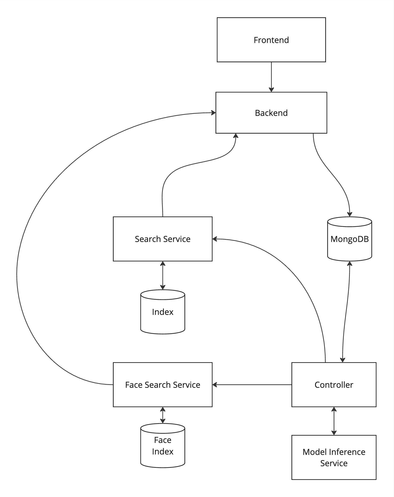

# ShortVideoSearchEngine

Это поисковый движок по коротким видео, который может искать видеоролики по описанию визуальной части видеои и по тому, что обсуждается голосом, а также искать ролики с известными людьми. Решение может работать с запросами на разных языках

[](https://www.youtube.com/watch?v=fF6dPa-ulEs)

# Как запустить решение:
1. Создать основной .env файл в корне проекта со следующими переменными:

```
MONGO_USER=admin
MONGO_PASSWD=admin
```

2. Создать frontend/.env файл для указания адреса бекенда

```
VITE_API_URL=<backend_url_with_port>
```

3. Распаковать [модели](https://disk.yandex.ru/d/rnqyDA6c5Hw9rg) в корень проекта

4. Запустить ```docker compose --env-file .env up --build```

# Доступные сервисы

1. [Frontend](http://search.latedev.ru/) или по [адресу](http://158.160.101.131/)
2. [Backend](http://search.latedev.ru:8000/) или по [адресу](http://158.160.101.131:8000/). Также доступен [swagger](http://158.160.101.131:8000/docs)
3. [MongoDB](http://search.latedev.ru:5051/) или по [адресу](http://158.160.101.131:5051/)


# Архитектура



1. Frontend - интерфейс пользователя
2. Backend - обрабатывает запросы на поиск и добавление видео. При поиске делает запросы к Search Service и Face Search Service. При добавлении видео делает запись в MongoDB
3. MongoDB - хранит промежуточные состояния и статусы обработки видео
4. Model Inference - обрабатывает запросы к ML моделям. Функциональность моделей: 
 - Поиск лиц и извлечение векторов признаков из лиц
 - Определение языка речи
 - Распознавание речи
 - Извлечение из кадров видео вектора признаков
4. Controller - агрегирует результаты выполнения ML моделей в MongoDB. При окончании работы моделей, отправляет полученные результаты в индексы
5. Search Service - отвечает за поиск по векторам признаков кадров и речи. Содержит языковую модель BGE-M3 для перевода запросов пользователей и текст речи в вектора признаков
6. Face Search Service - отвечает за поиск по векторам признаков лиц

# Производительность

1. Поиск - 4 запроса в секунду
2. Добавление нового видео - от 10 до 60 секунд в зависимости от сложности видео

# Технологический стек

## Frontend

1. Vue3

## Backend

1. FastAPI
2. python-socketio
3. aiohttp
4. uvicorn
4. motor
5. pymongo
6. requests

## Machine Learning

1. Pytorch
2. Transformers
3. Nvidia Triton Server
4. Nvidia Nemo Toolkit
5. speechbrain
6. insightface
7. scikit-learn
8. ONNX

## Дальнейшие улучшения

1. Добавить использование нечеткого поиска в дополнение к поиску по векторам
2. Распознавание текста на видео, т.к. некоторые видео содержат только текст
3. Расширение запросов пользователей через LLM для добавления допольнителной информации к запросу
4. Анализ пользовательских запросов для оптимизации поиска под конкретные нужды пользователей
5. Анализ истории просмотров пользователей для более точного ранжирования поисковой выдачи
6. Дообучение базовых моделей для векторизации кадров, создания описаний видео и распознавания речи
7. Улучшение поиска по отдельным категориям, например, чтобы мы могли более точно определять блюда, а не просто понимать, что это еда
